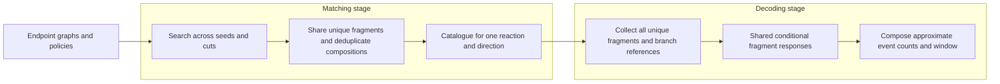
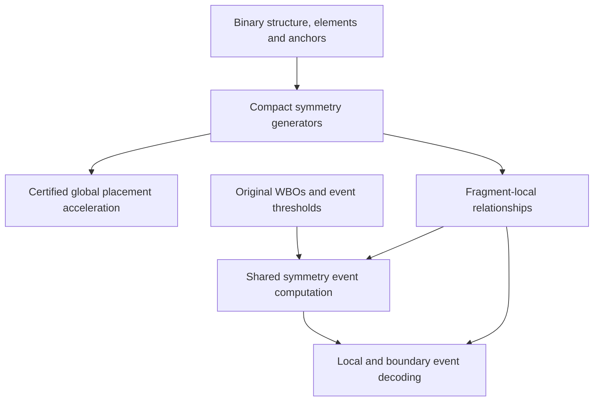
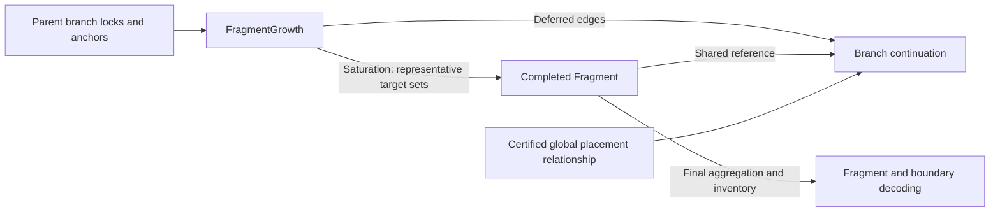
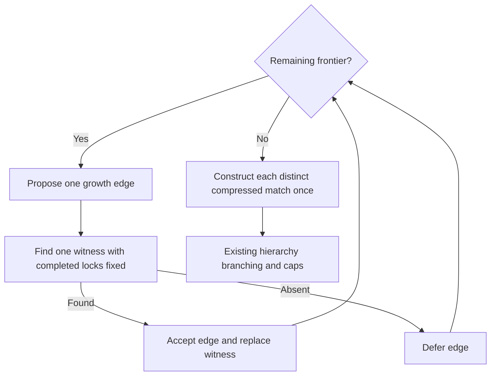
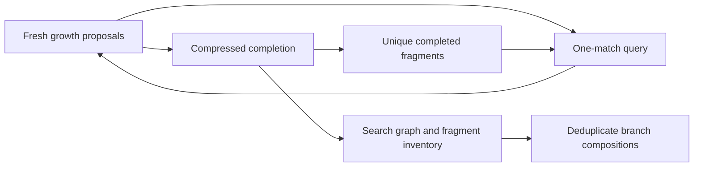
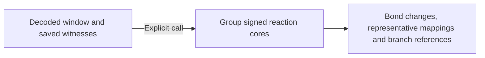
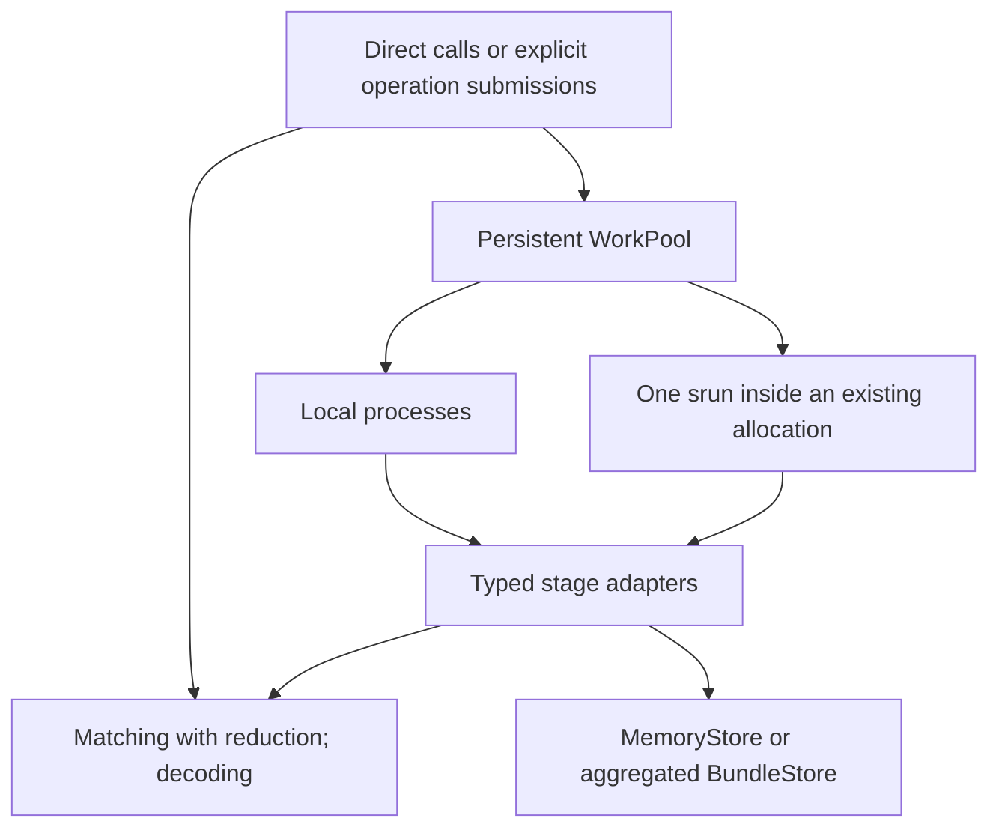
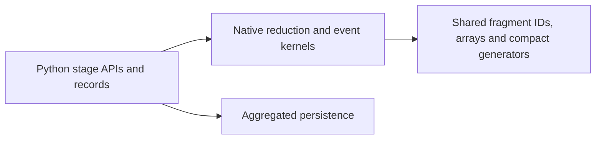
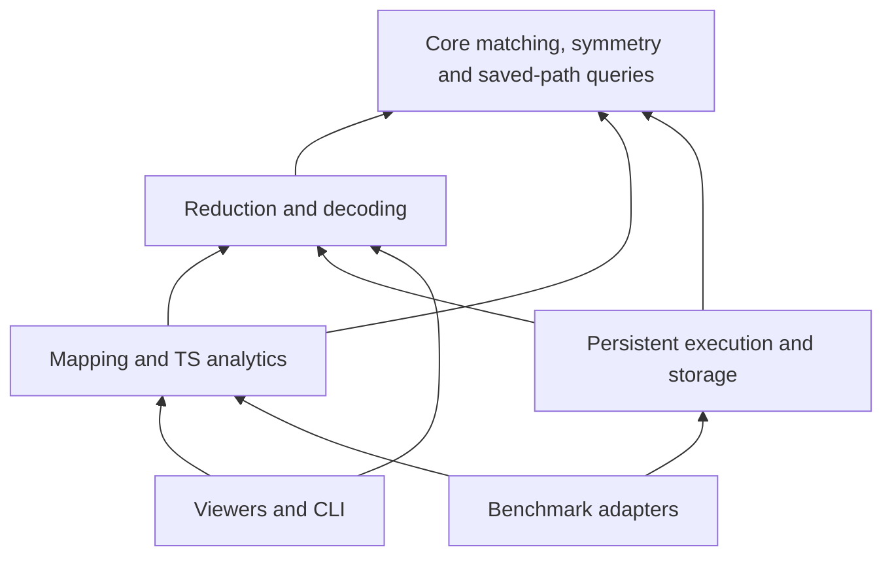

# MAPPA design

This document defines the approved scientific design and module boundaries.
The goal is fast, accurate mapping with one-witness fragment growth, direct
compressed completion, and two scientific stages: matching and decoding.
Reduction consolidates unique fragments and branch compositions as the final
subphase of matching. Its separate API does not make it a third scientific stage.
Implementation status, measurements and repair history belong in `reports/`;
usage details belong in `docs/`.

## Design principles

- Keep scientific operations separate: growth, completion and reduction within
  matching, followed by decoding, have explicit inputs and outputs. External reference verification evaluates
  saved results; it does not participate in mapping.
- Store each scientific relationship once. Share immutable fragments and
  correlated symmetry actions; do not reconstruct competing representations or
  expand complete bijection tables for transport or presentation.
- Put reusable mathematics in core. Workflows, execution, viewers and benchmark
  adapters consume core operations; core never imports their orchestration.
- Keep one implementation owner per responsibility. Remove superseded code,
  modes and repair scripts after replacement. Git preserves historical source.
- Preserve explicit incompleteness. Resource limits, bounded optimization and
  the ordinary-boundary approximation cannot become exact scientific claims.
- Optimize without changing the declared mapping relation. Validate scientific
  changes against independent small examples and measure comparable work.

## Scientific pipeline

```mermaid
flowchart LR
    Input[Endpoint graphs and policies] --> Search
    subgraph Matching[Matching stage]
      Search[Search across seeds and cuts] --> Reduce[Share unique fragments and deduplicate compositions]
      Reduce --> Catalogue[Catalogue for one reaction and direction]
    end
    Catalogue --> Inventory[Collect all unique fragments and branch references]
    subgraph Decoding[Decoding stage]
      Inventory --> Local[Shared conditional fragment responses]
      Local --> Compose[Compose approximate event counts and window]
    end
```

A cut is a search condition and provenance field, not the unit of decoding.
A representative mapping is one witness of a compressed family. Scheduling must
preserve the scientific stages and their meaning.
Reference verification is external evaluation logic, not a stage of the MAPPA
mapping pipeline. Catalogue recovery and recovery in the saved decoded response
are separate measurements. A decoded recovery requires an actual injective
witness produced by the saved starting correspondences and correlated symmetry
choices, in a retained branch context and event window. Preserve its replayable
choices and check its count directly against the original matrices. Report the
ordinary-boundary model count separately from the physical whole-reaction count;
membership in an approximate bin is not proof of that physical event count.
State whether reference indices are exact or normalized by endpoint chemical
symmetry. Resource-limited verification remains unknown.
An available catalogue certificate can prioritize a decoded query's search, but
is neither a prerequisite nor proof of decoded membership. Its absence or failure
must not block an independent audit of successfully saved decoded responses.
A catalogue witness may also supply a candidate for direct checking. Express it
using the saved starting correspondences only when allowed binary symmetry
operations preserve that same complete mapping. Acceptance still requires the
retained context, full action replay, annotated pairs, injectivity and independently
checked event count inside the saved window. An unsuitable candidate says nothing
about whether another decoded witness exists.

Before a decoded membership query, count the events already forced by the
annotated assignments, using the same fixed ordinary boundaries and conservative
sweep correction as the saved decoder. Reject a context only when that lower
bound exceeds its event window. Unspecified atoms contribute no forced internal
events. This filter performs no symmetry or minimum search and cannot establish
acceptance; surviving references still require a replayable joint witness.

## Inputs and matching rules

`AAMProblem` contains two `MolecularEndpoint` records: elements, coordinates
and bond-order matrices. In each search direction, the **base** is the endpoint
on which fragments grow and the **target** is where their placements are sought.
Either reaction side can be the base; reversing the search exchanges these
roles. Base/target describe the matching orientation, not a fixed chemical
direction. Existing API field names retain their recorded indexing conventions.
Matching uses those inputs and declared policies. Preparation must state which chemical attributes are represented;
elements and WBOs alone do not establish stereochemistry, charge or isotope
coverage.

Each direction retains its own seed/cut plan and atom-index frame. Concrete
reverse-direction witnesses may be inverted into input indexing; compressed
families and event identities retain their search-frame meaning.

Growth chooses a boundary atom uniformly, then an incident frontier edge
uniformly, without WBO ranking. Only the selected growth edge adds a matching
constraint. Other molecular bonds between included atoms are not implicitly
required. Accepted edges are saved in each fragment relation; complete original
endpoint bonds remain available for event interpretation. Joining a completed
fragment retains its locked assignments and earlier constraints.

`SearchSession` owns prepared matching state. Splitting work must preserve seed
indices, seed order, random settings and the full search scope. An indivisible
cut backend cannot be split into independently reseeded searches.

## Binary symmetry and shared event core

A **global symmetry** describes rearrangements of one whole endpoint. A
**fragment symmetry** describes rearrangements of the fragment's own internal
graph, with its anchors fixed. A **relaxed isomorph** describes a base-to-target
mapping. Discovery tolerance controls growth; event thresholds classify original
bond-weight changes. There is no separate self-tolerance filter.

Construct each symmetry from a binary graph: bonds
above the declared presence threshold share one structural label, elements are
preserved, and each anchor is fixed. Nauty supplies compact correlated structural
generators. Every composition of those generators is permitted. Original WBOs
remain attached for discovery constraints and event counting; numerical weight
differences do not restrict a binary self-rearrangement.

Global construction uses the whole endpoint; fragment construction uses the
selected fragment's internal graph. External attachments do not become local
constraints. The binary graph preserves connectivity at its declared threshold;
weight comparisons also retain internal subthreshold contacts. Accepted growth
edges remain separate discovery constraints. Neither the binary graph nor its
generators alone establish the complete relaxed base-to-target relation.

`core/symmetry/` owns binary symmetry construction, ordered shuffle programs,
joint endpoint-pair projection and original-weight event computation.
It has no dependency on matching, catalogue records or postprocessing. Global
and fragment-local construction use this same owner. Decoder-specific inventory,
boundary bookkeeping and branch-event assembly consume its shared responses.
Pair projections are local response domains; choices across different pairs
remain correlated through the original joint action. Minimum-event computation
separates independent symmetry components only when event terms do not join
them, and skips operations only when they preserve those responses. It retains
one actual witness and explicit completion status, with bounded search and
caches. No complete permutation group or Cartesian mapping table is materialized.
Raw search retains discovery alternatives. Completed atom-set fragments retain
their potential correspondences, while decoding selects one starting orbit.
Event optimization may deliberately examine only a bounded subset of starting
correspondences. Its result is best found unless a valid lower bound is attained
or complete coverage is certified. This does not narrow the saved mapping
relation. An orbit minimum is not a minimum over a larger relation unless coverage
is established. Exhausted search limits remain incomplete, never exact minima.

### Bounded starting-correspondence improvement

One candidate identifies one base/target atom-set placement. Different starting
correspondences on that placement need not be connected by binary symmetry.
Extra starting-correspondence search is restricted to special fragments: recorded
growth connectivity differs from the completed fragment's internal connectivity
on at least one endpoint, and the current witness has not already attained an
established minimum bond-event count. A loose event lower bound alone does not
make an ordinary fragment eligible. Optimize permitted fragment symmetries without
reapplying growth constraints to reject their resulting mappings.

Preserve the evidence needed to distinguish growth from final connectivity through
reduction, without making growth history part of completed-fragment identity.
Missing growth evidence is not evidence of a connectivity mismatch. For eligible
fragments, search for a useful starting correspondence within a fixed budget;
do not turn growth routes into additional completed fragments or enumerate all
starting classes.

Completed fragments are identified by their endpoint atom-set pair,
within the fixed endpoint problem and policy. Growth witnesses and accepted
edges do not create additional atom-set identities. Recorded anchors and locks
remain attached to their original decisions. Earlier joint actions can move a
later locked continuation; reduction preserves that order rather than erasing
locks or promoting them to whole-branch constraints.

Use a saved element-compatible correspondence as the incumbent. First obtain a lower bound by
matching the original pair-weight multisets within element-pair types, including
zero weights and subthreshold contacts, while relaxing atom consistency. If this
bound does not settle the saved witness, also relax each atom's incident bond
assignments and match the atoms injectively. Every bond event touches two atoms,
so half that minimum incident cost, rounded up, is another valid lower bound.
Use the stronger bound and stop immediately when it meets the witness. Improve
the incumbent through the shared binary-symmetry event core. Only for an eligible
connectivity-mismatch fragment whose current witness remains unsettled, search
the saved discovery relation for a better injective starting correspondence,
respecting its recorded domains, anchors and accepted edges, and apply that same
event core to it. These discovery checks do not veto subsequent permitted binary
symmetry rearrangements. Partial
original-weight event bounds account for injective occupancy of the remaining
atoms through a linear assignment; bonds between two unassigned atoms contribute
zero to that bound. These bounds guide the search; they do not prove absence of
better unexplored symmetry choices.

The default is one five-second wall-clock search deadline per unique fragment,
shared by preparation, discovery improvement and symmetry optimization. It is a
maximum allowance, not a target runtime. Stop immediately on an attained lower
bound. Otherwise retain one best actual witness and explicit incomplete optimality.
Time-limited answers may vary
with hardware; record the allowance, elapsed time, bound and work counts.

Core checks deadlines between operations and retains a valid incumbent. An
opaque operation can finish after its deadline; hard preemption belongs
to the execution layer's external watchdog. Native symmetry restriction and
factorization check the same remaining search allowance within their long loops.
Restrict disjoint generator-support components independently, preserving coupled
exchanges. Fixing every movable atom immediately leaves the identity. These
operations preserve the group relation; interruption retains an actual witness
or an explicitly unknown query, never a partial group presented as complete.
No scheduler or per-fragment worker
creation belongs in the scientific core. Bounded witness optimization does not
establish all event bins, endpoint-conditioned responses or a whole-reaction
minimum. Decoder assembly must preserve that distinction when consuming it.

```mermaid
flowchart TD
    Structural[Binary structure, elements and anchors] --> Symmetry[Compact symmetry generators]
    Symmetry --> Global[Certified global placement acceleration]
    Symmetry --> Local[Fragment-local relationships]
    Weights[Original WBOs and event thresholds] --> Core[Shared symmetry event computation]
    Local --> Core
    Core --> Decoder[Local and boundary event decoding]
    Local --> Decoder
```

## Fragment growth and completion

Fragment matching has two operations: find one witness during growth, then
construct the complete compressed placements when growth saturates.

### Growth decisions and saturation

Use `g = (B_g, A_g)` for the growing base atom set and accepted edges, and `L`
for earlier locked assignments. Growth asks whether the compatible injective
mapping set `M(g | L)` is nonempty. Its witness is provisional; earlier locks
remain fixed. Let `nu(g)` describe the number of distinct target atom sets that
admit such a map. This is explanatory notation, not a count computed during growth.

| Current -> proposed placement count | Action |
|---|---|
| 0 -> 0 | Reject the start: an unavailable seed is skipped, never expanded. |
| 1 -> 0 | Defer the edge; retain the current valid fragment and try the remaining frontier. |
| many -> 0 | The same deferral rule; retain the current valid fragment. |
| 1 -> 1 | Accept and continue growing. |
| 1 -> many | Accept with one witness; postpone branching. |
| many -> 1 | Accept with one witness; the larger fragment narrows the placements. |
| many -> many | Accept with one witness; postpone branching. |

Only when no eligible extension remains does saturation matching construct the
completed fragment placements. One target atom set owns one internal mapping
relation, including local symmetry. Certified global placement equivalence may
share entire continuations between sets. Hierarchical children are formed from
the retained completed placements, not temporary growth multiplicities.

### Fragment records and ownership

`FragmentGrowth` owns the changing search state. `Fragment` stores one
base-to-target placement and its growth evidence. Reduction groups and shares
the existing records by final atom-set pair; it does not reconstruct their
scientific contents.
There is no additional candidate or
`FragmentMatch` wrapper, or separate one-sided fragment record.

| Record | Logical fields |
|---|---|
| `FragmentGrowth` | `source_atoms`, `accepted_edges`, `deferred_edges`, `frontier`, `witness` |
| `Fragment` | `source_atoms`, `target_atoms`, initial `witness`, recorded anchors, `source_symmetry`, `target_symmetry`, `relation`, including accepted growth edges and discovery constraints |

The growth subgraph is exactly `source_atoms` with `accepted_edges`; no duplicate
subgraph representation is retained. Deferred edges are rejected extension
proposals, and the frontier contains remaining proposals. The current witness
may change its target atom set during growth. The parent branch supplies fixed
assignments and the anchor/lock context. Original molecular bonds remain in the
reaction data, separate from the accepted growth subgraph.

At saturation, base self-automorph preparation is shared across placements.
Each retained representative target atom set produces one search `Fragment`, with its
anchor-aware binary target symmetry and complete compressed relaxed
base-to-target relation. That relation owns its witness, anchor pairs and joint
mapping constraints. Accepted edges retain the discovery evidence separately
from the constraints governing retained relaxed alternatives.

When a fragment locks, deferred edges needed for further search remain with the
branch continuation. They neither constrain fragment self-automorphs nor imply
bond events. Branch state also owns cut provenance and inter-fragment boundary
context. Sharing a completed fragment does not merge these continuation states.
Checkpoints preserve their relevant context without retaining discarded growth
histories. Fragment reuse validates the current query rather than replaying a
previous continuation.

Original atom lists, anchors and prepared self-relationships are stored once and
referenced where shared; the table describes logical access, not duplicate
payloads. Global relationships used to accelerate placement discovery belong to prepared
reaction search state. A completed matching operation also supplies a shared
placement relationship to its branch transitions. This relationship connects
equivalent target atom sets; it is separate from each fragment's local relation.
Scheduling, cache transport and storage policy remain outside these records.

One matching-operation result carries the fragment collection, shared deferred
continuation and completion/cap status. Each child transition references its
chosen fragment directly in the existing hierarchy. Final reduction and decoding
retain those scientific records rather than reconstructing a second fragment
representation from dictionaries.

```mermaid
flowchart LR
    Parent[Parent branch locks and anchors] --> Growth[FragmentGrowth]
    Growth -->|Saturation: representative target sets| Fragment[Completed Fragment]
    Growth -->|Deferred edges| Continuation[Branch continuation]
    Fragment -->|Shared reference| Continuation
    Global[Certified global placement relationship] --> Continuation
    Fragment -->|Final aggregation and inventory| Decoder[Fragment and boundary decoding]
```

### One-witness existence

Each proposal asks whether the enlarged fragment has an injective,
policy-compatible placement. Extend the current witness when possible; otherwise
search again with earlier assignments within the growing fragment free to change.
Assignments of previously completed fragments remain fixed.

The same exact solver finds a witness or proves absence. Degree, compatibility
and injectivity checks prune impossible choices without excluding valid mappings.
Only proven absence rejects an edge; a timeout or resource limit is not evidence
that no match exists. Accepted proposals replace the witness. Rejected proposals
are deferred while the remaining frontier is explored.

### Direct compressed completion

At saturation, completion uses the full accepted constraints and the current
witness to discover representative target atom sets within its fixed base
fragment, parent and anchor context. Distinct sets may share one continuation
only when a saved global relationship proves their remaining search problems
equivalent. Every represented placement remains recoverable through that
relationship. Overlapping sets remain eligible.

Placement compression uses a certified subgroup of the global binary symmetry.
It preserves the full target WBO matrix, active connectivity and
all base-to-target node compatibility, and fixes every prior locked target
pointwise. Thus every later matching constraint is preserved under composition.
Callers whose continuation depends on additional target labels declare those
labels fixed for placement compression; this does not occupy them for matching.
Binary connectivity alone does not establish this stronger condition.
Uncertified rearrangements never justify dropping a continuation.

Discover one representative per target-set orbit. Compact orbit exclusions and
conditioned symmetry pruning participate in search; do not enumerate all orbit
images or internal bijections and then merge them. The branch cap counts these
representative continuations at every hierarchy level. A representative count
is not the number of labelled target placements it represents.

Search continues with one representative assignment and ordinary occupancy. The
saved placement relationship subsequently acts on the entire continuation,
moving later fragments together. It never independently moves one fragment into
another's occupied target. Each decision applies its local relation, then its
placement action; complete programs apply decisions in reverse chronological
order. Retain that order through caches, checkpoints, reduction, mapping queries
and decoding, including unmatched and cut-boundary events.

Each candidate retains its complete compressed internal mapping relationship,
using anchor-aware fragment binary symmetry. Global symmetry
does not substitute for the fragment's own relationship. Free pools are a special
case derived from that relationship, not an independent compression rule.
One witness and one structural action are not assumed to cover every permitted
mapping on a target set. The representation must establish complete coverage
while preserving correlations and avoiding full-bijection expansion.

The discovery witness satisfies the base-to-target `iso_tol`. Binary symmetry
alternatives may exceed that discovery tolerance; original-WBO decoding evaluates
their events. Records distinguish discovery evidence from the retained symmetry.

For one fixed base/target atom-set pair, let D contain every mapping satisfying
the accepted discovery constraints. Retain both base and target permitted
self-rearrangements: each final mapping is beta composed with d composed with
alpha inverse, where d belongs to D and alpha/beta each preserve their own
fragment's binary graph, elements and anchors. An accepted discovery bond can become
an event after rearrangement. Decoding counts and classifies those changes under
the original endpoint WBOs. Its bounded starting-correspondence selection and
event window restrict the decoded response, not the saved matching relation.

A completed fragment is identified by one atom-set pair and retains its original
mapping relation and growth evidence. That identity does not replace the relation
with unrestricted element-compatible bijections. Decoding retains the bounded
search's selected starting correspondence and its correlated binary symmetry
response. Potential catalogue membership and membership in a selected decoded
response are different measures; report them separately. Independent atom
choices must not introduce forbidden combinations.

Matching preserves valid mappings, accepted/deferred bonds, locks and
legitimate compressed branch choices. Duplicate records and intermediate merge
history are not scientific requirements. Regrouping choices requires the
placement-equivalence proof above; similar events, witnesses or atom labels
alone do not suffice.

For each parent branch, each retained representative completed-fragment match
produces one child continuation with its saved placement relationship. Symmetric
bijections inside that match are not separate branches.
After each completed search step, apply the cap bottom-up at every hierarchy
level. Each node counts distinct surviving continuations below it. If over the
cap, remove its largest child subtree, recount and repeat until within the cap;
ties preserve the earlier decision. Ancestors use the reduced descendant counts,
so pruning below can spare their other subtrees. A shared continuation remains
reachable through its retained parents, without retaining a rejected decision
path. Seed policies apply this rule independently even when computation is shared.
The completed-fragment limit remains an early rejection of a placement result
that exceeds the cap; it does not truncate intermediate one-witness growth.
Completion, stalls and caps remain explicit; capped search is not an exhaustive
absence proof.

```mermaid
flowchart TD
    Frontier{Remaining frontier?} -->|Yes| Proposal[Propose one growth edge]
    Proposal --> Query[Find one witness with completed locks fixed]
    Query -->|Found| Accept[Accept edge and replace witness]
    Query -->|Absent| Defer[Defer edge]
    Accept --> Frontier
    Defer --> Frontier
    Frontier -->|No| Complete[Construct each distinct compressed match once]
    Complete --> Branch[Existing hierarchy branching and caps]
```

| Core module | Responsibility |
|---|---|
| `growth/engine.py` and native growth loop | Select proposals and record accepted/deferred constraints. |
| `growth/existence.py` and native `fragment_query.h` | Find one witness or prove absence, reusing the current witness where possible. |
| `growth/completion.py` and native `fragment_completion.h` | Construct distinct compressed matches from the completed constraints. |
| Shared symmetry core and matching representation | Supply relaxed global and fragment-local relationships and compact result records. |
| Reaction search | Lock completed placements, form child branches and enforce hierarchy caps. |

There is one growth algorithm, with no legacy mode or error-triggered fallback.
Candidate-growth replay, generate-then-deduplicate completion, candidate-prefix
checkpoints, candidate-deduplication metadata and symmetry-certificate retention
are outside this design. Cross-seed/cross-cut family reduction is a separate,
required stage.

Python and native execution obey the same scientific contract. Native execution
is the normal path; explicit Python execution supports diagnostics and custom
policies. Unsupported capabilities and execution failures are reported, never
silently routed to another algorithm. Historical records keep their recorded
scientific meaning; loading cannot reinterpret decoding as rematching.

## Unique-fragment reuse during growth

Matching accumulates a reaction's known fragments, keyed only by the base and
target atom-set pair. Keep one original fragment per pair. Its discovery witness
can prove that a smaller temporary fragment has at least one match. This reuse
works across branches, seeds and cuts; it does not reuse a completed growth path.

First try the cheap extension of the current witness. If no unoccupied target
atom of the required element remains, reject the extension immediately: rearranging
the witness cannot increase that element's available count. Otherwise consult the
fragment pool: the stored witness must cover the proposed atoms, respect current
locks and target availability, and satisfy every currently required edge at the
current tolerance. Atom-set inclusion alone is insufficient. A valid restriction
answers **yes** immediately. A pool miss makes no claim about absence; the same
existence solver then answers the query normally. No symmetry or bijection
enumeration is needed to test a stored witness.

Use an inverted bitset index for atom containment, supported edges and fixed
assignments. Intersect these sets to select a valid stored witness instead of
validating saved witnesses one record at a time. Prepare edge support when a
fragment is inserted, rebuilding it only if the tolerance policy changes. Hits bypass matcher
query construction. Index storage shares the pool's retention budget, and eviction
removes its proof bits. Measure lookup overhead as well as the work it avoids.

For example, after finding `R{1,2,3,4} → P{a,b,c,d}`, a later proposal for
`R{2,3}` can use `2→b, 3→c` if those targets remain available and its required
edge is satisfied. A different seed or an unrelated cut does not invalidate
this proof. A newly required edge or conflicting lock must be checked.

Growth keeps selecting its own proposals. Each cut/trial has a distinct,
reproducible random stream, independent of worker assignment or seed batching.
Saturation selects its representatives independently of the temporary existence
witness, so cache contents cannot choose the returned mapping or cap outcome.
There is no whole-growth replay cache or dependency-tracking layer.

The pool has a 64 MiB accounted retention budget per prepared direction; eviction
changes reuse only. Accounting conservatively charges each entry's referenced
self-preparations and its index. This bounds pool retention, not total search
memory. Raw decisions retain their own locks and accepted edges. The returned
search graph carries a unique-fragment inventory for reduction to reuse.
Switching reactions releases the prepared reaction state.

```mermaid
flowchart LR
    Growth[Fresh growth proposals] --> Exists[One-match query]
    Pool[Unique completed fragments] --> Exists
    Exists --> Growth
    Growth --> Completion[Compressed completion]
    Completion --> Pool
    Completion --> Graph[Search graph and fragment inventory]
    Graph --> Reduction[Deduplicate branch compositions]
```

### Shared reaction cache snapshots

Shared snapshots belong to the execution layer; the matching algorithm exports
and imports cache data without scheduling workers or performing shared-file I/O.
Each reaction/configuration has an immutable first-snapshot **baseline** and a
replaceable **latest** snapshot, with separate directional content. Workers check
the latest published version at task boundaries and reuse their resident version
when current. A failed latest load may use the baseline after integrity and
context checks. This approved data-recovery path is not an algorithm fallback.
If both stored versions are unusable, the error remains explicit.

One coordinator owns publication. Only an accepted publisher writes a complete
staged snapshot; the coordinator replaces the latest snapshot atomically. Readers
retain their opened version while replacement occurs. Stale publishers cannot
overwrite newer versions. Only changed retained entries are published, with
updates coalesced to limit storage overhead. Scientific results are published
independently of cache snapshots.

Snapshots contain unique fragment records, never growth trajectories or branch
outcomes. Import merges useful local and received records by atom-set pair.
Snapshot transport validates checksums, endpoint identity, policies and code
compatibility, and reapplies the resident memory budget. Cache I/O, hits and
recovery are measured. Persistent snapshot count is bounded per reaction, never
per seed, sweep or cut.

## Search records and family reduction

The retained representation has three distinct levels:

| Level | Identity and responsibility |
|---|---|
| `AAMSearchGraph` | Contexts, states, transitions, roots and stop evidence, including compressed placements and seed/cut histories. |
| `AAMResult.branches` | Paths grouped by the unordered collection of final endpoint fragment atom-set pairs. |
| `FinalBranchCatalogue` | Saved mapping families, their alternative fragment partitions and provenance. |

Native transport returns the typed search graph with immutable shared state
blocks. Binary checkpoints and pool handoffs preserve that sharing. Explicit
record/JSON export may expand views and need substantially more memory. Storage
sharing does not merge scientific alternatives or enumerate fragment bijections.

Matching retains the full ancestry of live continuations and returned results,
including every incoming path at a join. Once a path has no surviving descendant,
its mapping, fragment and boundary payloads are released during ordinary search,
before transport or publication. Cap evidence records the context, seed, step,
stage, attempted count, limit and occurrence count without retaining rejected
child states. A cap summary is not a returned mapping. Shared-policy searches
also retain decisions still reusable by their active policies, and release that
working state when those policies finish. Incompatible historical fragment schemas are rejected; use their producing
revision to inspect them without changing their scientific meaning.

Graph combination concatenates and reindexes histories; it does not deduplicate
final families. Public branch grouping retains every path. Seed order, growth
history, island labels, anchors and witnesses do not split an atom-set branch;
different representative atom sets or fragment pairings do. Saved placement
relationships retain the additional labelled sets without expanding branch
records. Live continuation contexts
cannot be discarded merely because their final atom-set groups coincide.

One catalogue per endpoint problem and direction reduces all supplied seeds and
cuts under the fixed policy. Reuse each search graph's fragment inventory, then
unify its keys across graphs. An explicitly selected path subset supplies its
own records; it cannot borrow a representative from an excluded path.
Keep exactly one fragment record per endpoint
atom-set pair. Retain the first original record intact and reference it from every
branch using that pair. Different starting witnesses, discovery domains and growth
routes do not create additional fragment records or local decoding jobs.
Deduplicate branch compositions by their shared fragments and ordered placement
context, independently of the growth witness.

The atom-set pair is a deduplication key, not a replacement fragment payload.
Reduction preserves the retained record's witness, discovery domains, accepted
growth edges, anchors and symmetry relationships through shared immutable references.
It must not rebuild a fragment with broader mapping permissions, erase constraints
or reinterpret growth information. Discard duplicate fragment records, rather
than retaining their alternative witnesses or combining their constraints. Raw
search archives retain the original decisions; compact provenance does not cause
those decisions to be decoded again. The selected record supplies one starting
correspondence; symmetry optimization and the existing bounded starting-position
search handle alignment. This is representative selection, not preservation of
the union of every discarded discovery relation.

Retain ordered global placement alternatives as branch context: they move whole
continuations and must not permit independent overlapping occupancy. Such
alternatives can share one atom-set branch and its local fragment responses.
Retain the selected local relations and placements together. Reorder only
independent decisions; overlapping actions preserve their recorded order.
Reduction performs structural key lookups and provenance aggregation. It does
not solve symmetry, search for starting maps or count events. Binary symmetry
preparation is deferred until a consumer needs it.

Project completed states to shared fragment IDs in one native operation, then
deduplicate their compositions using those IDs. Reuse base partitions and
prepared fragment actions. Consume shared immutable state blocks directly;
temporary conversion reuse is scoped to one input graph. Ordered placement
programs are collected once per shared search state. Keep growth provenance as
parent links and terminal references, with path counts computed on the shared
graph; do not unfold every
growth path during reduction, decoding or publication. Explicit history replay
may expand requested paths. Sweep setup reads the saved cut/partition metadata
directly from those references.

The catalogue preserves base growth histories, cut provenance and alternative fragment
partitions. Raw paths, public atom-set branches and catalogue families are separate
counts. Completed search graphs may be ingested one at a time; the accumulated
catalogue and provenance still consume memory.
Restoring a catalogue shares equal immutable mapping, constraint and action
records while preserving every family's values, action order and provenance.
Apply the same sharing during construction, before serialization. Comparison keys
borrow immutable matrix storage and retain exact byte equality and ordering;
hashes never replace equality checks or retain another matrix-sized payload.
Equal-shaped, byte-identical fragment weight matrices share storage even when
their atom sets or anchors differ. Their fragment and symmetry records remain
distinct, and existing comparison keys reference that same shared allocation.
Trusted binary transport restores already validated scientific fields without
repeating construction checks. Binary decoded output shares numeric weight arrays;
only explicit JSON export expands them to lists. Reduction reuses immutable fragment hashes and
prepared transition actions; each saved path still contributes its provenance.

## Decoding: shared fragment responses and branch queries

First inventory every unique completed Fragment and every branch, partition and
sweep reference. The matching catalogue records potential atom-set placements.
For decoding, select one starting correspondence per unique Fragment using the
bounded improvement above, then retain both sides' element- and anchor-preserving
binary symmetries. For an aligned equal-connectivity pair, one side suffices.
Other starting correspondences need not lie in this selected
symmetry orbit: this is an explicit coverage restriction, not exhaustive decoding
of every potential correspondence on the atom-set pair.

The shared core response stores compact correlated generators, a fixed event
contribution and sparse variable original-WBO event terms. Independent symmetry
components are separated only when no variable event or requested endpoint joins
them. Operations with identical event effects can share computation. Neither a
complete permutation list nor a table of every attainable event count is stored.
A query retains the response and a count interval; finding a member returns a
valid witness or explicit absence/unknown within its compute allowance. Endpoint
conditions preserve occupancy and their correlation with internal event counts.

```mermaid
flowchart LR
    Catalogue[Matching catalogue] --> Inventory[Unique fragments and branch references]
    Inventory --> Start[Bounded starting-map improvement]
    Start --> Response[Shared binary-symmetry event responses]
    Response --> Branch[Ordered branch composition and sweep correction]
    Branch --> Window[Retained branches with a queryable event window]
```

Branches remain unique compositions referencing shared fragment responses.
Final partition pieces own disjoint internal bond contributions, including when
their original fragment relations overlap. Compose their local
choices and retain the saved global placement order, binding a shared placement
to one joint choice. Never replace an ordered placement sequence by unrestricted
group closure or allow two fragments to occupy the same target atoms.

Prepare and validate each shared local minimum operation once, then reuse it
when composing branch witnesses. Shared choices must still agree and operations
retain their recorded order. Assembly binds the prepared cost projections to their original shared choices;
it does not expand them back into raw bond terms. Weight-preserving placement
actions retain those internal costs while moving the endpoints. The sweep adds
only its endpoint-pair correction, with endpoint dependencies traced through the
saved action order. When internal costs are constant, resolve the sweep directly
over jointly reachable endpoint pairs, retaining one valid ordered choice as its
witness. This must not enumerate complete symmetry assignments. Variable internal
costs retain their dependence on the endpoints. Reuse local event-invariant compression only when it also
preserves every affected endpoint and other contribution. Accept an attained
lower bound immediately rather than searching again for the same minimum.

The event model uses the accepted **independent ordinary-boundary approximation**.
Add local internal events to a fixed ordinary boundary contribution, including
mapped/unmapped boundaries. Do not recompute ordinary boundaries for each choice.
The single sweep correction retains its joint endpoint/internal-event dependence
and contributes a residual from zero to two events. Count it once. Alternative
partitions and sweep histories are alternative compositions, never additive ones.

For window selection, let L be the smallest composition lower bound before the
sweep residual. When attained local minima compose, an attained branch upper
bound U is at most L+2: resolve only compositions that can improve U, then retain
those potentially within the best attained count plus the requested slack n
(default six). If a local search is unfinished or local minima conflict, retain
its honest lower bound and use an attained U instead; a loose lower bound plus
two is not a valid ceiling. Report whether the model minimum is proved. An
unfinished search never becomes absence or an exact minimum. Branch queries
preserve the surviving choices rather than exporting one chosen bijection.

Events use **original endpoint WBOs**, not cut search graphs. The ordinary
threshold defaults to 0.5 and the metal threshold to 0.3; an event requires a
strictly larger weight change. Breaking, forming, strengthening and weakening
are exclusive categories. Growth tolerance is separate. Count changes touching
mapped atoms, including mapped/unmapped boundaries; omit bonds wholly inside
unmatched material. Invent no correspondence for unmatched atoms.

When matching uses transformed weights, `event_problem` supplies original weights
for the same indexed atoms and coordinates. Discovery permissions remain tied to
the matching problem. Output retains both problems when their weights differ.

`EventDecodeSession` shares fragment preparation across uses. `EventInterpretation`
retains branches, responses, minimum/proof status and window. Explicit catalogue
proof evaluation remains available for inspection, including discoveries outside
the selected decoded orbit; it does not assert membership in a stored event
selection. Physical whole-reaction evaluation may differ from the approximate
boundary model and does not silently reassign model bins.

Saved results retain the unchanged matching catalogue, each selected starting
correspondence, shared response and window decisions. Every retained branch,
partition and sweep context also saves the attained count and lower bound already
computed during window selection. Store its witness as references to shared
action choices, rather than a repeated complete atom mapping. A refined sweep
result replaces the composed witness only when that refinement was already done;
saving must not add minimization searches. Equality of the bound and attained
count establishes the branch minimum; otherwise retain both without relabelling
the attained count as exact. Saved-minimum lookup never searches; the existing
minimum computation reuses an established saved result and otherwise retains its
original calculation. A saved-branch lookup groups recorded witnesses at a
requested count by their fragment atom-set composition. Internal symmetry
arrangements and repeated histories count once; this lookup does not search
for additional ties. Older
archives without the additive branch records remain readable and require their
existing explicit computation to obtain a branch result.
Loading reconstructs query
objects without rerunning starting-map optimization or symmetry preparation.
Prepared responses share identical immutable fragment weights and uniform event
thresholds. Pair-weight summaries retain exact multiplicities; sweep endpoints
retain only their incident summaries, deriving nonincident counts from the shared
fragment summary. Storage compression changes no event bound or permitted choice.
Calculation-only branch state is released when the independent saved record is
ready, before publication. Persist only compact
relations and sparse costs; their size is still not a bound on total reaction
memory. Scheduling and hard resource watchdogs remain outside the scientific core.

Normal assembly and persistence consume the shared core responses directly.
Do not also construct or save per-bond lookup tables for a fragment whose cost
is already represented there. Explicit bond inspection derives those lookups
when requested; ordered contexts without a whole-fragment projection prepare
the terms needed by their joint cost. Such terms share one local sequence and
one action-position binding per branch use, rather than relabelled copies.

## Optional reaction-core extraction

`extract_reaction_cores(decoded)` is a separately called post-processing
operation after decoding establishes its event window. It groups the saved
witnesses inside that window by their signed physical bond-event pattern,
using the existing event identity and thresholds. A requested event count can
restrict the lookup. Different fragment compositions may describe the same
reaction core; equal event totals alone do not make cores equivalent.

Each core retains a representative base-to-target mapping, decreasing bonds
in base indices, increasing bonds in target indices, and its supporting
family/partition/cut references. Weakening and strengthening are included.
Saved model counts remain separate from the representative's physical count.
The operation reuses recorded choices without further matching, minimum search
or enumeration of symmetry alternatives. Its output describes observed net
reaction alternatives, not exhaustive cores or elementary-step pathways.
It belongs to mapping analytics and is not invoked by the scientific pipeline.

```mermaid
flowchart LR
    Saved[Decoded window and saved witnesses] -->|Explicit call| Cores[Group signed reaction cores]
    Cores --> Output[Bond changes, representative mappings and branch references]
```

## Local and distributed execution

Simple local calls remain `search_aam`, `deduplicate` and `decode_events`.
`mappa.execution.WorkPool` exposes these operations through typed
`MatchingResult`, `CatalogueResult` and `DecodingResult` handoffs. Execution
strategy must not change scientific settings, task identities or results.

```mermaid
flowchart TB
    User[Direct calls or explicit operation submissions] --> Core[Matching with reduction; decoding]
    User --> Pool[Persistent WorkPool]
    Pool --> Local[Local processes]
    Pool --> Slurm[One srun inside an existing allocation]
    Local --> Adapter[Typed stage adapters]
    Slurm --> Adapter
    Adapter --> Core
    Adapter --> Storage[MemoryStore or aggregated BundleStore]
```

The pool starts persistent workers once, validates source/engine identity and
waits for every requested worker to be ready. Startup failure is explicit.
Slurm does not submit a job per scientific task. Dependencies, scheduling,
leases, budgets, transport and storage belong entirely to the execution layer.
Workers run one compute process each without nested pools and reuse prepared
state within a reaction. Affinity can prefer the same reaction while allowing
other ready work to saturate the pool; it cannot alter search order or policies.

`MemoryStore` communicates intermediates in RAM. `BundleStore` persists immutable
ranges in aggregated worker bundles, with explicit reaction indexes. Persistent
file count grows with workers and byte volume, never with seed, sweep or cut
count. Small payloads may remain in bounded memory spools; larger ones use local
scratch. Durable publication retains integrity checks and shared state.

Massive benchmarks finish and audit matching, including cross-seed/cross-cut
reduction, before starting decoding. This barrier is scheduling policy, not a requirement
to load the entire dataset into RAM. The decoding job is one reaction/direction
catalogue, with original endpoints, policies, integrity metadata and a manifest
of completed, capped, failed or missing search work. It loads that catalogue,
collects its unique fragments, decodes, publishes and releases the result.
A cut or isolated fragment is not an independent decoding job without a design
that preserves shared constraints and actions.

The coordinator maintains a bounded window of active reactions and an aggregated
campaign ledger. Retired task specifications and attempt histories remain
archived. Separate allocations may own disjoint reaction batches; completion of
one allocation does not imply completion of the matching pass. A fresh benchmark
starts with empty results and caches and imports immutable endpoint/reference
inputs. Re-decoding saved catalogues under a new event policy does not rerun
matching.

Recovery preserves completed outputs, original task identities, attempt history
and consumed compute budgets. Case time counts overlapping computation once;
publication and idle time do not replenish it. Extra retry time or a changed
resource allowance must be explicit. Failure, resource limits, lost leases and
incomplete scope remain distinguishable from scientific absence. Coordinator
loss requires explicit recovery.
Diagnosed execution errors may be retried explicitly with a recorded reason,
preserving failed attempts and remaining budgets; they are never retried automatically.

Cross-node execution requires compatible code, inputs, artifact paths and clocks.
Storage-root relocation preserves offsets and checksums, including nested
references; it cannot change saved scientific content. Checkpoint migration stops
source writers and gives destination workers disjoint ownership.

## Verification and performance

Reference event-offset analysis is a direct comparison of saved counts. Subtract
the original detected model minimum across directions from the event count of
a verified GT-consistent full mapping, choosing the lowest already recorded
verified count across directions. Both counts use the same all-atom event model.
Unannotated atoms use that witness's feasible completion; the analysis performs
no new optimization. Do not replace its count by a GT-containing branch's
minimum, which may belong to a different mapping, or by a lower bound. Separately
obtained reference-anchored completions may supply missing mappings for this
analysis without changing independent recovery. Preserve their provenance.

Reference verification queries the retained mapping relation under an explicit
atom subset and endpoint-equivalence policy. One witness, element sets or event
counts cannot establish coverage of every compressed choice. Completed catalogue
membership means the reference fits a retained atom-set composition and its
joint placements; it does not establish membership in the selected decoded
symmetry orbit or event window. Report those metrics separately when comparing
reduction semantics. Heavy-atom
references leave hydrogen correspondence unspecified. Unknown, timeout, capped
search and missing work remain distinct from proven absence.

For a completed atom-set composition, verification first tries to construct a
full injective correspondence containing the annotated reference, including
unannotated atoms. Acceptance requires validation through the saved relation.
References needing global placements or endpoint equivalence use the joint query.
That query first rejects references outside conservative per-atom bounds of
the complete ordered relation, including both local self-relationships,
placements and endpoint equivalence. These bounds cannot establish acceptance;
survivors retain every joint constraint. Reuse shared immutable action preparation
and stop work once absence is proven. Construct physical output expressions only
for callers that need a mapping or an event query.
Membership queries may absorb a self action only when it is certified to preserve
every discovery constraint. The returned mapping still carries a valid discovery
and symmetry witness. Reduced finite constraints are transferred to the native
solver in one batch; this changes query execution, not the retained mapping
relation or the reference-equivalence policy.

Exact annotated-index catalogue verification shares fragment membership answers
across compositions. Reject impossible atom-set compositions before solving local
relations. Independent fragment answers compose directly; overlapping local or
global placement choices retain their original joint order. Cache the complete
local query conditions, not just an atom-set Boolean. Unannotated atoms still
require full feasible local assignments. Element-preserving actions that only
move unannotated element classes do not couple the annotated query. Replay the
accepted composition against its saved family and retain its full injective
certificate. Unknown local answers remain unknown. This changes verification
execution only; it neither expands catalogue permissions nor proves decoded
event-window membership.

Matcher acceptance requires independent mapping-relation checks, meaningful
branch and cap checks, and Python/native agreement. Critical cases include C6
into C6 producing one compressed match, and C6 into two rings retaining both
placements: two representatives when attachments distinguish them, or one with a
certified relationship when the whole target permits their exchange. A proven
impossible query must return zero without unnecessary search.
Broader validation covers locks, tolerances, accepted/deferred edges, symmetry
correlations, transport, reduction, decoding and reference membership.

Performance is an acceptance condition alongside accuracy. Compare identical
scientific scope, measuring matching, completion, publication, scheduling and
memory separately. Resource measurements include the process tree and sampling
coverage; an unsampled short task is not evidence of zero memory use. A cache
budget does not bound total resident memory, and local tests do not establish
cluster scaling. Use the checks in [README.md](README.md); retain independent
scientific oracles and report the actual validation scope in `reports/`.

## Module ownership

Paths below are relative to `src/mappa/`.

Reduction and decoding use the existing C++ backend for bulk scientific
operations: assignment-domain updates and event bounds, compact permutation
operations, shared response binding and composition bookkeeping. Python owns
the public records and stage APIs; native operations consume shared integer
IDs and prepared arrays rather than calling Python inside atom-level loops.
The shared symmetry core remains the single owner of the mathematics consumed
by both fragment preparation and decoding. This execution boundary changes no
mapping permissions, event model, action order, cache limits or completeness
rules. Work buffers are bounded or released with their stage; scheduling and
storage remain outside the native scientific operations.

```mermaid
flowchart LR
    API[Python stage APIs and records] --> Native[Native reduction and event kernels]
    Native --> Shared[Shared fragment IDs, arrays and compact generators]
    API --> Storage[Aggregated persistence]
```

| Owner | Location |
|---|---|
| Shared endpoint, configuration and result records | `mappa_core/domain.py` |
| Fragment growth, existence and completion | `mappa_core/core/matching/` |
| Relaxed relationships, correlated shuffles and bond responses | `mappa_core/core/symmetry/` |
| Seed/cut planning, locking and hierarchy branching | `mappa_core/core/search/` |
| Saved-path relation compilation and assignment queries | `mappa_core/core/search/queries/` |
| Branch grouping and family reduction | `mappa_core/post_processing/final_branches.py` |
| Unique-fragment inventory and event decoding | `mappa_core/post_processing/decoder/` |
| Persistent local/Slurm pool API | `execution/` |
| Scheduling, task handoffs, recovery and storage | `mappa_core/core/scheduler/` |
| Mapping analytics and external event/reference evaluation | `mappa_workflow/mapping_analytics/` |
| Native scientific implementation and transport | `mappa_core/native/` |
| Versioned persistence | `mappa_core/utils/io/` |
| Explicit reaction-to-TS analysis | `mappa_workflow/ts_analytics/` |
| Saved-result and growth views | `presentation/` |

```mermaid
flowchart BT
    Core[Core matching, symmetry and saved-path queries]
    Post[Reduction and decoding] --> Core
    Workflow[Mapping and TS analytics] --> Core
    Workflow --> Post
    Execution[Persistent execution and storage] --> Core
    Execution --> Post
    Presentation[Viewers and CLI] --> Workflow
    Presentation --> Post
    Bench[Benchmark adapters] --> Execution
    Bench --> Workflow
```

Arrows mean dependency. Schedulers, CLIs, viewers and benchmark adapters consume
these owners rather than implementing competing algorithms. Presentation owns
rendering, offline packaging and navigation; tools only adapt inputs and write
outputs. Display alignment does not change scientific atom correspondence.

This document is the current design contract. `docs/` describes supported usage;
`bench/` owns maintained experiment runners; `reports/` preserves measurements
and provenance, with historical scripts linked to their producing Git revision.
Historical results do not establish current-method accuracy. Explicit persistence
relocations preserve unchanged records; incompatible scientific schemas are
rejected. Superseded implementations belong in Git, not fallback paths.

Usage guides: [Python API](docs/PYTHON_API.md),
[shared execution](docs/shared-execution.md), and [viewers](docs/VIEWERS.md).
