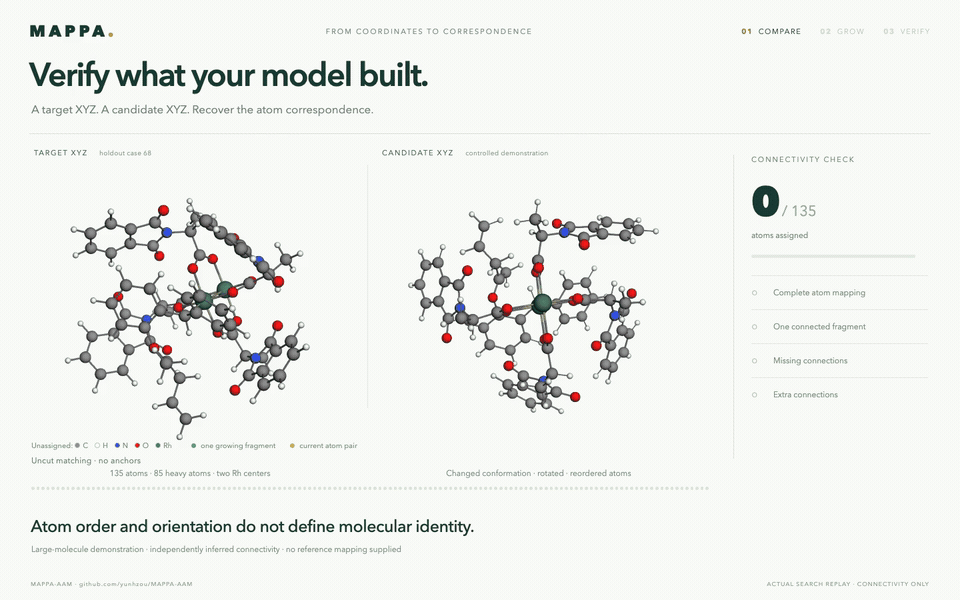

# Verify what your model built

Unassigned atoms use standard element colors (oxygen red, nitrogen blue, carbon gray, hydrogen white); fragment colors appear as matching progresses.

A **28-second 3D demonstration** of checking a candidate XYZ against a 135-atom target. The film shows the actual MAPPA atom-by-atom growth, with rotating structures, a traveling atom-pair highlight and a final connectivity check.



[Full-resolution MP4](molecule-verification.mp4) · [Offline interactive film](index.html) · [Self-contained XYZ example](../../../examples/molecule_verification/README.md)

## Sequence

- **0–4.5 s:** compare the target and a candidate with changed conformation, orientation and atom order.
- **4.5–18 s:** replay one recorded seed placement and all 134 actual single-atom extensions. Green shows the growing fragment; gold highlights the current pair. Both Rh centers retain their gold element accent.
- **18–22 s:** confirm 135/135 atoms, one connected fragment, no missing connections and no extra connections.
- **22–28 s:** present the connectivity verdict and its scope while the molecules continue rotating.

The target is the 135-atom reactant from holdout case 68, `pr17.carbene.ins_ts6a`. The candidate is a **controlled demonstration, not model output**. It was constructed using four torsional changes, small coordinate perturbations, a rigid rotation and reordered atoms. No reference mapping enters MAPPA.

Both binary connection matrices are inferred independently from the XYZ files with RDKit's covalent-radius rule. The final witness preserves all **148 inferred connections**. The one-fragment result is checked against both edges and nonedges, so an extra candidate connection cannot silently pass. This is a connectivity check, not a check of bond order, charge, stereochemistry or energetic stability. Camera motion is presentation, not dynamics.

## Evidence and reproduction

[Verification result](verification.json) · [Recorded trajectory](trajectory.json.gz) · [Frame-level validation](science-validation.json) · [Browser validation](browser-validation.json) · [Film data](film-data.json)

From an installed checkout with RDKit:

```bash
python examples/molecule_verification/verify.py --output verification-output --capture
python manuscript/scripts/verification_film/build.py \
  --run verification-output \
  --output manuscript/animations/molecule_verification \
  --library src/mappa/static/3Dmol-min.js \
  --preparation examples/molecule_verification/preparation.json
node manuscript/scripts/verification_film/render.cjs \
  manuscript/animations/molecule_verification --video
python manuscript/scripts/verification_film/export_gif.py \
  manuscript/animations/molecule_verification
```

Rendering requires Playwright, Chrome and FFmpeg. Set `PLAYWRIGHT_MODULE`, `CHROME` or `FFMPEG` for their local paths. The HTML film is self-contained after downloading. The MP4 is 1440 × 900 at 24 fps; the GIF is 960 × 600 at 12 fps. Browser validation checks that every growth step appears in the MP4 timeline and that displayed mappings remain injective. The builder checks film frames against the saved trajectory and confirms that the display transformations preserve molecular distances.
