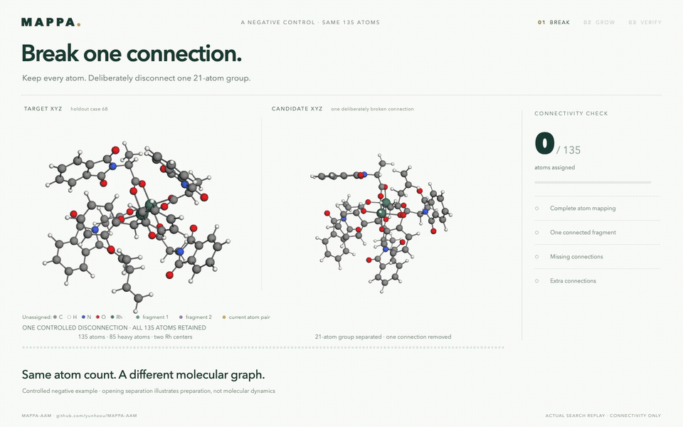

# Same atoms. Different connectivity.

Unassigned atoms use standard element colors (oxygen red, nitrogen blue, carbon gray, hydrogen white); fragment colors appear as matching progresses.

A **30-second 3D negative control** accompanying the [successful verification film](../molecule_verification/README.md). One C–C connection is deliberately removed from the candidate XYZ by translating a 21-atom group. All 135 atoms remain present.



[Full-resolution MP4](broken-molecule-verification.mp4) · [Offline interactive film](index.html) · [Runnable XYZ example](../../../examples/molecule_verification/README.md)

The actual unswept MAPPA search returns a complete diagnostic witness in **two fragments: 114 + 21 atoms**. It has **one missing connection and zero extra connections**. The original target has 148 inferred connections and one component; the broken candidate has 147 connections and two components. These graph invariants establish the mismatch independently of which symmetry-related atom mapping is chosen.

The film first illustrates the deliberate separation, then replays the recorded search on the fixed broken geometry. It includes two seed placements, all 133 single-atom extensions and both recorded boundary deferrals. Green and purple show the two mapping fragments. The red × marks the missing connection, with the existing target bond retained as a black line. The first fragment stops at 114 atoms; growth restarts in the remaining group. The final panel keeps atom coverage green while showing failed connectivity checks in red.

The opening coordinate separation is an illustration of input preparation, not dynamics or a chemical reaction pathway. Both graphs are inferred independently from XYZ using the same RDKit covalent-radius rule as the intact example. Bond order, charge, stereochemistry and energetic stability are outside this check. The candidate is a controlled example, not generative-model output. Symmetry can shuffle equivalent ligand attachments, so the final target marker follows the returned witness rather than imposing the original construction labels.

## Evidence and reproduction

[Verification result](verification.json) · [Recorded trajectory](trajectory.json.gz) · [Scientific validation](science-validation.json) · [Browser validation](browser-validation.json) · [Media validation](media-validation.json) · [Film data](film-data.json)

```bash
python examples/molecule_verification/verify.py \
  --candidate examples/molecule_verification/candidate-broken.xyz \
  --output verification-broken-output --capture
python manuscript/scripts/verification_broken_film/build.py \
  --run verification-broken-output \
  --library src/mappa/static/3Dmol-min.js \
  --preparation examples/molecule_verification/break-preparation.json \
  --intact examples/molecule_verification/candidate.xyz \
  --output manuscript/animations/molecule_verification_broken
node manuscript/scripts/verification_broken_film/render.cjs \
  manuscript/animations/molecule_verification_broken --video
python manuscript/scripts/verification_broken_film/export_gif.py \
  manuscript/animations/molecule_verification_broken
```

Rendering uses Playwright, Chrome and FFmpeg. The MP4 is 1440 × 900 at 24 fps and the GIF is 960 × 600 at 12 fps. The HTML contains its viewer library and data for offline use. The builder verifies the returned witness and each displayed growth frame against the saved trace. Browser validation confirms that all atom placements appear and that the full-coverage state still receives the failed verdict.
