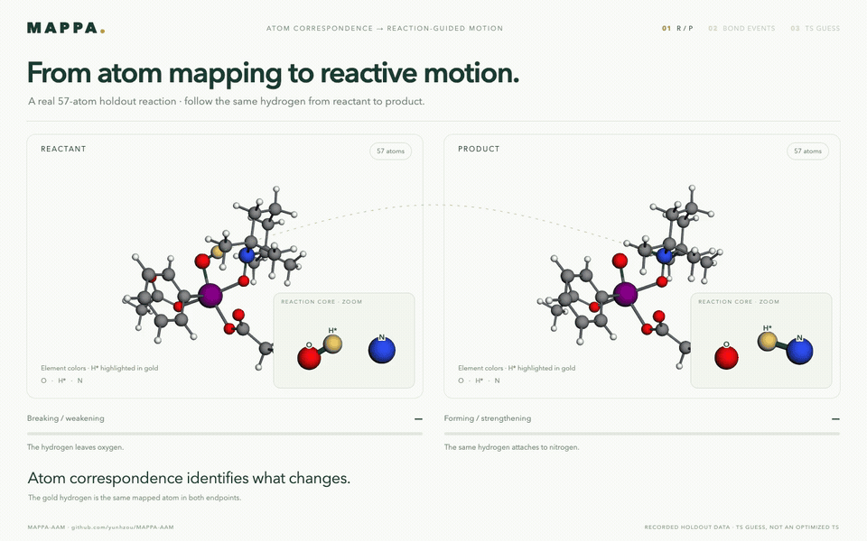

# From R/P mapping to guided TS mode selection

Unassigned atoms use standard element colors (oxygen red, nitrogen blue, carbon gray, hydrogen white); fragment colors appear as matching progresses.



[30-second video](rp-to-ts-mode.mp4) · [Interactive film](index.html) · [Recorded input](inputs/recorded-case.json) · [Current TS result](current-ts-score.json)

The 57-atom holdout case `pr1.tempo_ts3`, initial guess 1, demonstrates the existing MAPPA TS workflow. A saved R/P mapping identifies O–H weakening and N–H strengthening. Independent R→guess and P→guess core searches agree on the O/H/N assignment. The film then animates two **recorded, full-molecule Hessian displacement vectors** about that same guess geometry.

| Recorded mode (one-based) | Frequency, cm⁻¹ | Bond-direction overlap | Treatment |
|---|---:|---:|---|
| 1 | 1129.9292i | 0.869866 | Selected imaginary mode |
| 20 | +189.36 | 0.107 | Stable comparison mode; ineligible for selection |

This guess has **one imaginary mode**. The stable comparator illustrates different motion; it is not a second eligible imaginary candidate or a runner-up. Its overlap is a diagnostic computed with the same reaction vector. The film does not claim a validation benchmark across TS guesses.

For the selected core assignment, the production score is the mode overlap multiplied by weighted bond-order progress: **0.869866 × 0.535756 = 0.466036**. The earlier saved selection was the same mode with score 0.466034; the small difference comes from the cached Hessian-stage versus earlier scoring WBO values. The export checks agreement within 10⁻⁵. [All mode overlaps and eligibility](all-mode-overlaps.json) are retained.

The bond vector is constructed at the guess geometry: separating each breaking pair and approaching each forming pair, weighted by the absolute R/P WBO change. MAPPA uses the absolute normalized projection, so changing the sign of an eigenvector leaves the overlap unchanged. Spectator motion contributes to the full-mode norm. Among imaginary modes, the workflow chooses the highest overlap for each allowed core assignment and then scores the assignments.

The opening uses a **saved endpoint mapping**, not a newly invented interpolation or an atom-growth replay. The TS stage was rerun with the current public `analyze_transition_state` API. Its default search and scoring settings are used; no new limits are introduced for the film. Recorded endpoint, guess, WBO and mode arrays are bundled, with no electronic-structure calculation needed to reproduce the scoring.

## Visual interpretation

Gold H* is the transferring hydrogen. Red × denotes breaking/weakening; green inward arrows denote forming/strengthening. The black/gray sticks show the recorded WBO graph at floor 0.2; they do not encode integer bond orders. In particular, both partial bonds can appear at the guess.

Both displayed modes use the **same displacement multiplier, 0.60**, preserving every atom's relative displacement. The close-up contains the three core atoms; the main view animates all 57 atoms. Rotation and camera zoom are display-only. The common oscillation speed is illustrative: an imaginary mode has no physical sinusoidal period. This is displacement-vector visualization, not dynamics, an IRC, or a trajectory between endpoints.

The geometry is an **initial TS guess, not an optimized or validated TS**. The selected mode can guide a subsequent TS search; convergence, stationary-point characterization and endpoint connectivity still belong to that later workflow.

## Reproduce

From the repository root with MAPPA installed:

```bash
python examples/ts_mode_selection/replay.py
python manuscript/scripts/ts_mode_film/build.py \
  --source manuscript/animations/ts_mode_selection/inputs/recorded-case.json \
  --library src/mappa/static/3Dmol-min.js \
  --output /tmp/mappa-ts-mode-film
node manuscript/scripts/ts_mode_film/render.cjs /tmp/mappa-ts-mode-film --video
python manuscript/scripts/ts_mode_film/export_gif.py /tmp/mappa-ts-mode-film
```

Rendering requires Playwright, Chrome and FFmpeg. Set `PLAYWRIGHT_MODULE`, `CHROME` and `FFMPEG` if they are outside the normal paths. Scoring/export has a 300-second watchdog. The video is 1440 × 900, 24 fps; the README preview is 960 × 600, 12 fps.

[Scientific checks](science-validation.json) verify the selected mode, earlier score agreement, coherent bond-length derivatives and preserved displacement vectors. [Browser checks](browser-validation.json) verify mode eligibility, seek behavior and error-free rendering. [Media checks](media-validation.json) verify both encoded outputs.

## Source provenance

All nine original XYZ, WBO, mode and selection files were already published in repository commit `56367c66ed53aad58ce2fe2b028aabe70dcbd2fe`, before the example-artifact cleanup. [Public-source verification](public-source-verification.json) records unauthenticated HTTP 200 responses and SHA-256 identities matching every export source byte for byte. The bundled numerical input is derived solely from those files.
